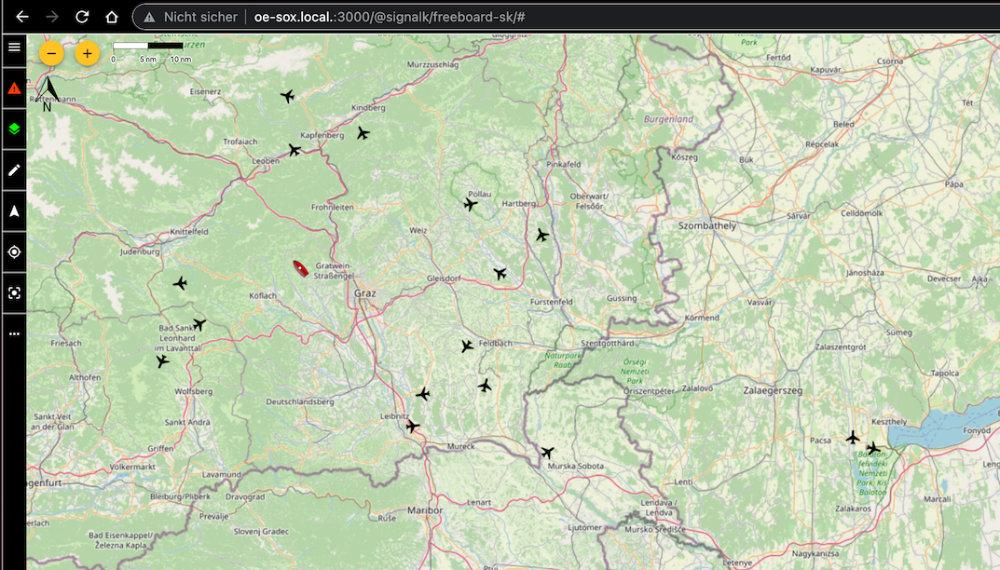
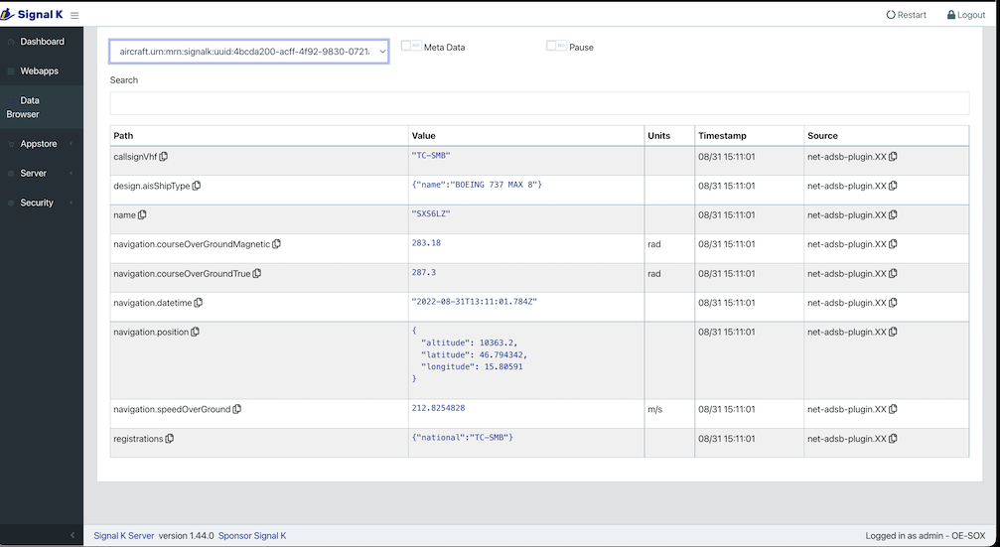

# signalk-net-adsb-plugin

SignalK plugin to gather ADS-B traffic information from a [readsb](https://github.com/wiedehopf/readsb) instance - an RTL-SDR based ADS-B decoder which is used by [tar1090](https://github.com/wiedehopf/tar1090).




This code connects to the 'JSON port' of readsb (usually port 30012), which must be explicitely enabled in /etc/default/readsb:

```
RECEIVER_OPTIONS="--device 0 --device-type rtlsdr --gain -10 --ppm 0 --net-connector localhost,2947,gpsd_in"
DECODER_OPTIONS="--max-range 450 --write-json-every 1 --db-file-lt --db-file=/usr/local/share/tar1090/aircraft.csv.gz"
NET_OPTIONS="--net --net-heartbeat 60 --net-ro-size 1250 --net-ro-interval 0.05 --net-ri-port 30001 --net-ro-port 30002 --net-sbs-port 30003 --net-bi-port 30004,30104 --net-bo-port 30005"
JSON_OPTIONS="--json-location-accuracy 2 --range-outline-hours 24 --net-json-port=30012 --net-json-port-interval=1"
```

Some properties are injected into SignalK:




# Status

- attribute mapping is extremely simplistic, likely buggy and not yet useful.
- proper mapping will require an extension of the SignalK schema for aircraft.
- this currently at the proof-of-concept stage

# Credits

Inspired by [signalk-net-ais-plugin](https://github.com/KEGustafsson/signalk-net-ais-plugin) by [Karl-Erik Gustafsson](https://github.com/KEGustafsson).


# example report by readsb:

This is the kind of message read by signalk-net-adsb-plugin:

```
mah@oe-sox:~$ nc localhost 30012 |jq
{  "now": 1661952465.404,
  "hex": "440829",
  "type": "adsb_icao",
  "flight": "AUA978B ",
  "r": "OE-LWM",
  "t": "E195",
  "desc": "EMBRAER ERJ-190-200",
  "alt_baro": 3575,
  "alt_geom": 3975,
  "gs": 208.6,
  "ias": 202,
  "tas": 196,
  "mach": 0.324,
  "wd": 105,
  "ws": 19,
  "track": 53.19,
  "track_rate": 2.5,
  "roll": 24.96,
  "mag_heading": 43.24,
  "true_heading": 47.93,
  "baro_rate": 3328,
  "geom_rate": 2656,
  "squawk": "2000",
  "emergency": "none",
  "category": "A3",
  "nav_qnh": 1017.6,
  "nav_altitude_mcp": 12000,
  "nav_altitude_fms": 12000,
  "nav_modes": [
    "vnav",
    "tcas"
  ],
  "lat": 47.039826,
  "lon": 15.445651,
  "nic": 8,
  "rc": 186,
  "seen_pos": 0,
  "r_dst": 10.957,
  "r_dir": 119.2,
  "version": 2,
  "nic_baro": 1,
  "nac_p": 10,
  "nac_v": 2,
  "sil": 3,
  "sil_type": "perhour",
  "gva": 2,
  "sda": 2,
  "alert": 0,
  "spi": 0,
  "mlat": [],
  "tisb": [],
  "messages": 231,
  "seen": 0,
  "rssi": -1.8
}
```